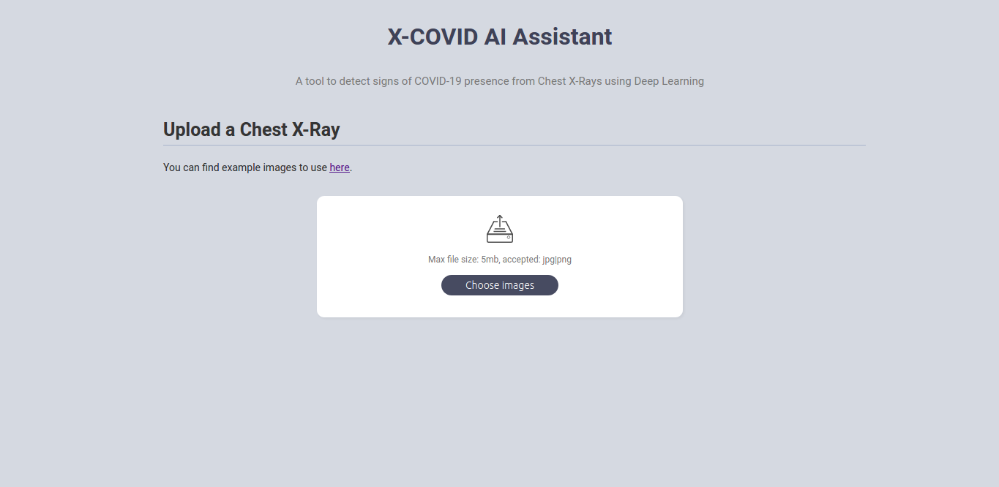
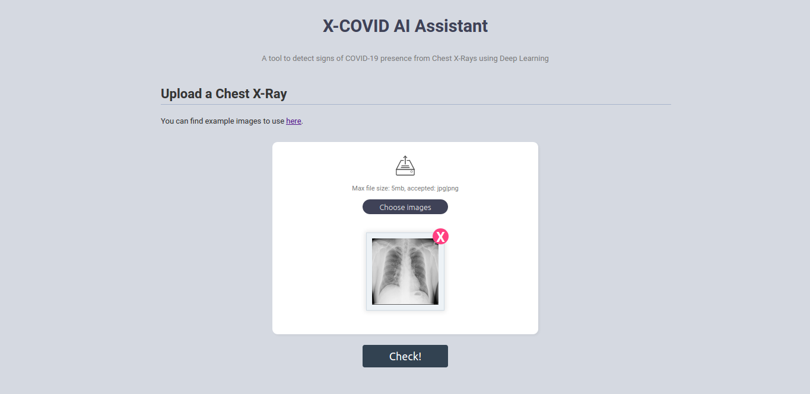
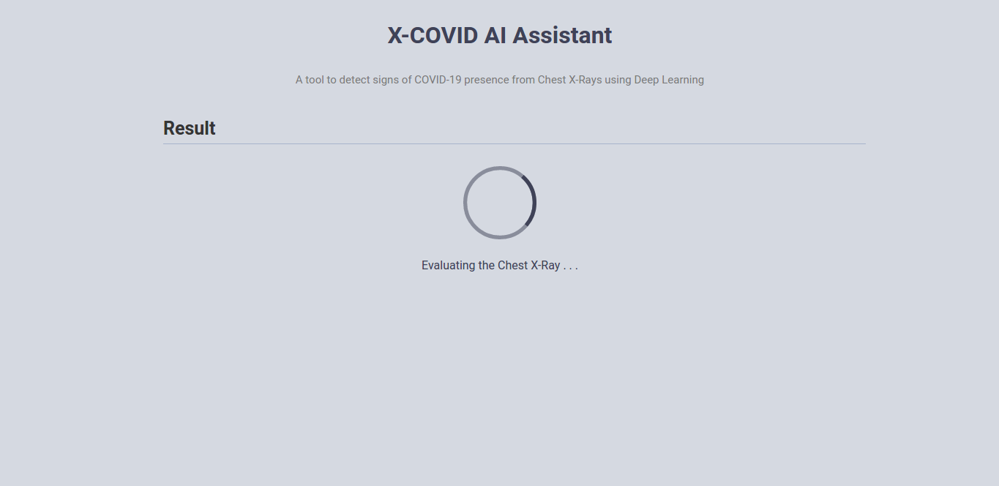
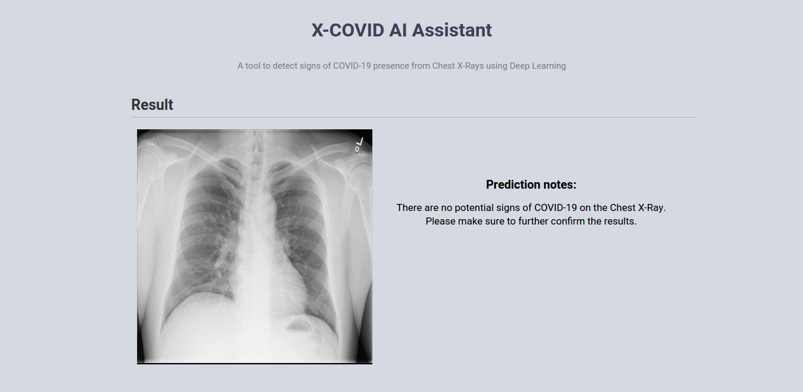

# X-COVID AI Assistant

A Web Application to detect signs of COVID-19 presence from Chest X-Rays using Deep Learning.

## How to use

**Step 1**: Open the application via a web browser



**Step 2**: Upload the Chest X-Ray that you want to check. For testing purposes, you can use a sample image that we provide.



**Step 3**: Click the "Check" button and wait for the evaluation process to complete (usually this takes less than 10 seconds)



**Step 4**: The model's prediction is ready!



## Prerequisites

* Docker
* Docker-compose

## Deployment

### Step 1 - Download COVID-NET pretrained model

* Download all the files from this [link](https://bit.ly/CovidNet-CXR-Large)
* Add all these files in the folder *backend/src/cnn_model/*

  Your folder structure must look like this:
  
  ```bash
  ./backend/src/cnn_model/
  │  ├── savedModel/
  │  │   ├── saved_model.pb             
  │  │   └── variables/
  │  │   │   ├── variables.data-00000-of-00001  
  │  │   │   └── variables.index
  │  ├── model.meta       
  │  ├── model-8485.index   
  │  ├── checkpoint
  │  └── model-8485.data-00000-of-00001         
  ```

### Step 2 - Environment variables (optional)

Add a *.env* file in the root folder of the project and set the following variables:

| Environment variable | Description | 
| :-------------: | :-------------: |
| BASEURL | Base URL that is used for the requests |

### Step 2 - Run

Start:

    docker-compose -f docker-compose.yml up --build

Stop:

    Ctrl-C
    
**For detached mode**:

Start:

    docker-compose -f docker-compose.yml up -d --build

Stop:

    docker-compose down
